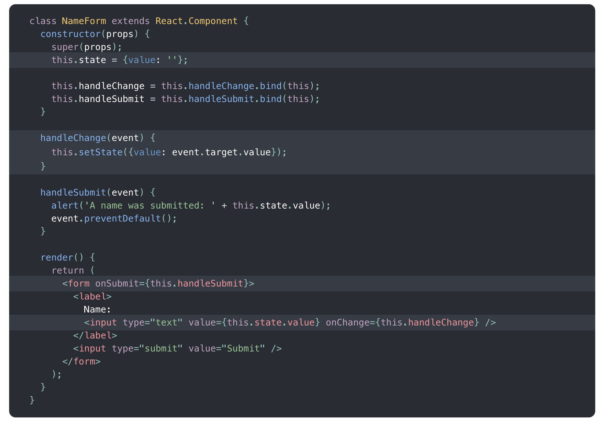

# Read 04: React and Forms

## 🏡 [**Home**](https://mistidinzy.github.io/ReadingNotes/)

> **1** [Introduction to React & Components](/read01.md)
>
> **2** [States & Props](/read02.md)
>
> **3** [Passing Functions as Props](/read03.md)
>
> **4** [React & Forms](/read04.md)
>
> **5** [Thinking in React](/read05.md)
>
> **6** [Node.js • npm • Pair Programming](/read06.md)
>
> **7** [REST • HTTP • API Keys](/read07.md)
>
> **8** [APIs](/read08.md)
>
> **9** [Functional Programming](/read09.md)
>
> **10** [In Memory Storage](/read10.md)
>
> **11** [Mongo and Mongoose](/read11.md)
>
> **12** [CRUD](/read12.md)
>
> **13** [Diversity & Inclusion in the Tech Industry](/read13.md)
>
> **14** [Authentication](/read14.md)

_____

[React Docs - Forms](https://reactjs.org/docs/forms.html)

_____

In HTML, form elements such as `<input>`, `<textarea>`, and `<select>` typically maintain their own state and update it based on user input.

In React, mutable state is typically kept in the state property of components, and only updated with `setState()`.

The React component that renders a form also controls what happens in that form on subsequent user input.

_____

`What is a ‘Controlled Component’?`

An input form element whose value is controlled by React.

In React, the component that renders a form also controls what happens in that form upon user input.

_____

Example:

_____

`Should we wait to store the users responses from the form into state when they submit the form?`

`or`

`Should we update the state with their responses as soon as they enter them?`

Update the state as soon as they enter their responses.

`Why?`

So we can control what happens in the form, depending on what they put into it.

_____

`How do we target what the user is entering if we have an event handler on an input field?`

Add a name attribute to each element and let the handler function choose what to do, based on the value of **event.target.name**

_____

[The Conditional (Ternary) Operator Explained](https://codeburst.io/javascript-the-conditional-ternary-operator-explained-cac7218beeff)

`Why would we use a ternary operator?`

To simplify conditional expressions.

Frequently used as a shortcut for the `if` statement.

`Rewrite the following statement using a ternary statement:`

let ternary = (x===y ? console.log(true) : console.log(false); )

_____

**Bookmark/Skim:**

[React Bootstrap - Forms](https://react-bootstrap.github.io/components/forms/)

[React Docs - conditional rendering](https://reactjs.org/docs/conditional-rendering.html)

_____
