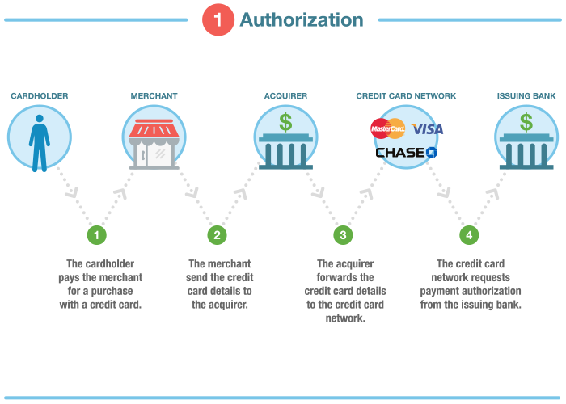
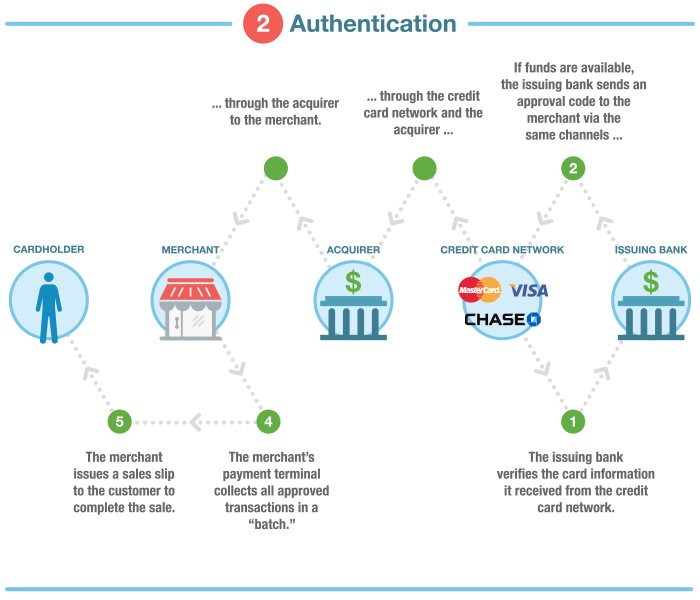
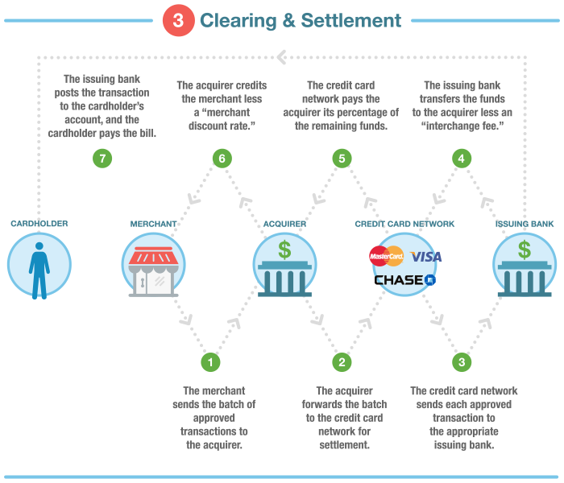

# Read 34b: Payment Processing

## 🏡 [**Home**](https://mistidinzy.github.io/ReadingNotes/) | [**401 Home**](https://bit.ly/3EcMrF6)

---

## Reading Links

[How to read technical documentation](https://bit.ly/3HIX5Gc)

[How Credit Card Processing Works](https://bit.ly/3l0FKP3)

[How ONLINE Credit Card Processing Works](https://bit.ly/3nEEBhW)

[Authorize.net Developer Docs](https://bit.ly/3HJzJjr)

[Authorize.net .NET SDK](https://bit.ly/3FCklno)

---

## Stages of Payment Processing

1. **Authorization**
    * The merchant obtains approval from the issuing bank.
2. **Authentication**
    * The bank verifies the validity of the customer's credit/debit card.
3. **Clearing and Settlement**
    * The transaction is posted to the cardholder's account, and the merchant's statement.

To be able to process online transactions, a merchant must also have an **Internet Merchant Account.**

---

## Payment Gateway

The internet merchant account works together with the **Payment Gateway** to process online payments.

The payment gateway sends the credit card info to the appropriate internet merchant account over secure online channels.

It's also responsible for fraud checking and maintaining reliable links with the merchant.

Web applications can interact with the payment gateway in different ways.

Some may transfer the user to a separate page on the gateway to complete the payment, and then they will be transferred back when they are done.

Some applications may be set up to handle more of the process, so that the program actually controls the entry of the credit card info, and then passes that onto the Gateway through an API.

---

### Validation, Refunds and Settlement

Once a card clears, the payment gateway will return one or two order numbers that can be used for future reference of the transaction.

This way, a refund may be processed without actually needing to store any credit card information.

**Settlement** refers to the process of transferring funds from the customer to the merchant's bank. This process is managed by the Merchant Account, and usually takes several business days.

---

### Fees

Payment processing represents one of the biggest costs that merchants must confront, especially for small business owners.

There are several fees associated with card payment processing.

Some of these are:

* One-time setup fee ($100-200)
* Recurring monthly fees ($20-60)
* Per-transaction fees -- **which may either be fixed or a percentage**

---

---
