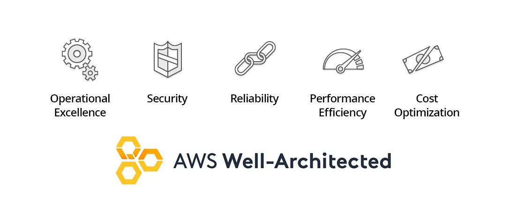

# Read 36: JAMstack

## 🏡 [**Home**](https://mistidinzy.github.io/ReadingNotes/) | [**401 Home**](https://bit.ly/3EcMrF6)

---

## Reading Links

[What is the JAMstack](https://bit.ly/3peQg6S)

Jamstack was originally cased as **JAMstack** where **JAM** stood for *JavaScript, API & Markup*.

Today, Jamstack is used to more broadly refer to an architectural approach for building websites.

JAMstack is a software architecture that adheres to the following components:

## Javascript &middot; APIs &middot; Markup

## **JavaScript**

Allows us to provide dynamic and interactive content that we couldn't do with plain HTML.

Dynamic functionalities are handled by JavaScript.

There is no restriction on which framework or library you must use.

## **APIs**

Server side operations are abstracted into reusable APIs and accessed over HTTPS with JavaScript.

These can be third party services or your custom function.

## **Markup**

Websites are served as static HTML files.

These can be generated from source files, such as Markdown, using a Static Site Generator.

HTML is the first and most important piece needed to build your app, it's like the skeleton.

---

### Why JAMstack?

JAMstack apps satisfy most if not all of the 5 pillars of the "*AWS Well-Architected Framework*"

### Main benefits provided by the Jamstack

- **Speed**: You can serve pre-built markup and assets over a CDN (**Content Delivery Network**).
- **Cost**: Hosting static files is cheap or even free.
- **Scalability**: If your product suddenly goes viral and has many active users, the CDN can seamlessly compensate.
- **Maintenance**: Front end devs can focus more on the front end, without being tied to a monolithic architechture. This usually means quicker and more focused development.
- **Security**: There's no need to worry about server or database vulnerabilities.

---

Although Javascript and APIs are commonly used components in a JAMstack app, the most important qualification is how you serve the Markup.

If you are serving an HTML file, without it having to be compiled on a server at request time, then you’ve got yourself a JAMstack site.

---

### JAMstack site examples

- [freecodecamp.org - Gatsby](freecodecamp.org)
- [Impossible Foods - Gatsby](https://impossiblefoods.com/)
- [Google's web.dev - 11ty](https://web.dev/)

---

### Constructing your app

- [11ty](https://www.11ty.dev/)
- [Gatsby](https://www.gatsbyjs.org/)
- [Hugo](https://gohugo.io/)
- [Nift](https://www.nift.cc/)
- [Scully](https://github.com/scullyio/scully)
- [Next.js](https://jamstack.org/generators/next/)

- [Several Others](https://jamstack.org/generators/)

---

### Serving your app

- [AWS](https://aws.amazon.com/getting-started/projects/host-static-website/)
- [Azure](https://docs.microsoft.com/en-us/azure/storage/blobs/storage-blob-static-website)
- [GCP](https://cloud.google.com/storage/docs/hosting-static-website)
- [Github Pages](https://pages.github.com/)
- [Netlify](https://www.netlify.com/)
- [Surge](https://surge.sh/)
- [Zeit](https://zeit.co/)

---

### API examples

- [Auth0](https://auth0.com/)
- [Cloudinary](https://cloudinary.com/)
- [Google Analytics](https://analytics.google.com/analytics/web/#/)
- [Stripe](https://stripe.com/)

- [Awesome Static Website Services](https://github.com/agarrharr/awesome-static-website-services)

Jamstack sites can also be controlled via a **Content Management System** or a **Headless CMS**.

Once a change in the CMS is made, a new build of your site will be triggered and then deployed as static assets.

[List of Headless CMS Services](https://jamstack.org/headless-cms/)

---
